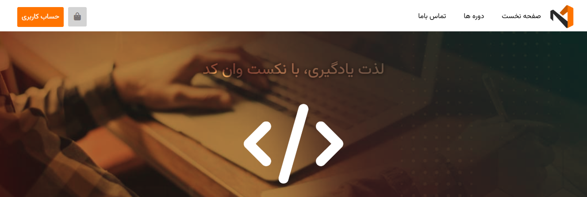

# Next One Code 🚀

## Overview 📌
This project is currently under development and will be improved over time. The main goal is to enhance its functionality, responsiveness, and maintainability.

## Current Status 🛠️
- The project is **not yet complete** and is being actively updated.
- Future improvements include making it fully responsive and improving code quality following clean code principles.

## Technologies Used 💻
- **HTML**
- **CSS**
- **SASS**

## Future Enhancements 🔮
- Implement **responsive design** once the core structure is complete.
- Refactor code for **better readability and maintainability**.

## Demo & Screenshot 🌍
- [Live Demo](https://whosfatima.github.io/next-one-code/) 🔗
-  🖼️

## How to Run the Project 🚀
1. Clone the repository:
   ```sh
   git clone <repository-url>
   ```
2. Open the `index.html` file in your browser.

## Contributions 🤝
Since the project is still in progress, contributions are welcome! Feel free to fork the repository and submit pull requests with improvements.

## License 📜
This project is open-source and available under the [MIT License](LICENSE).

